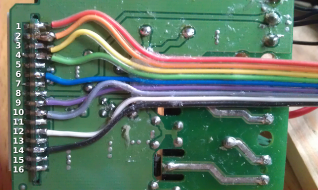
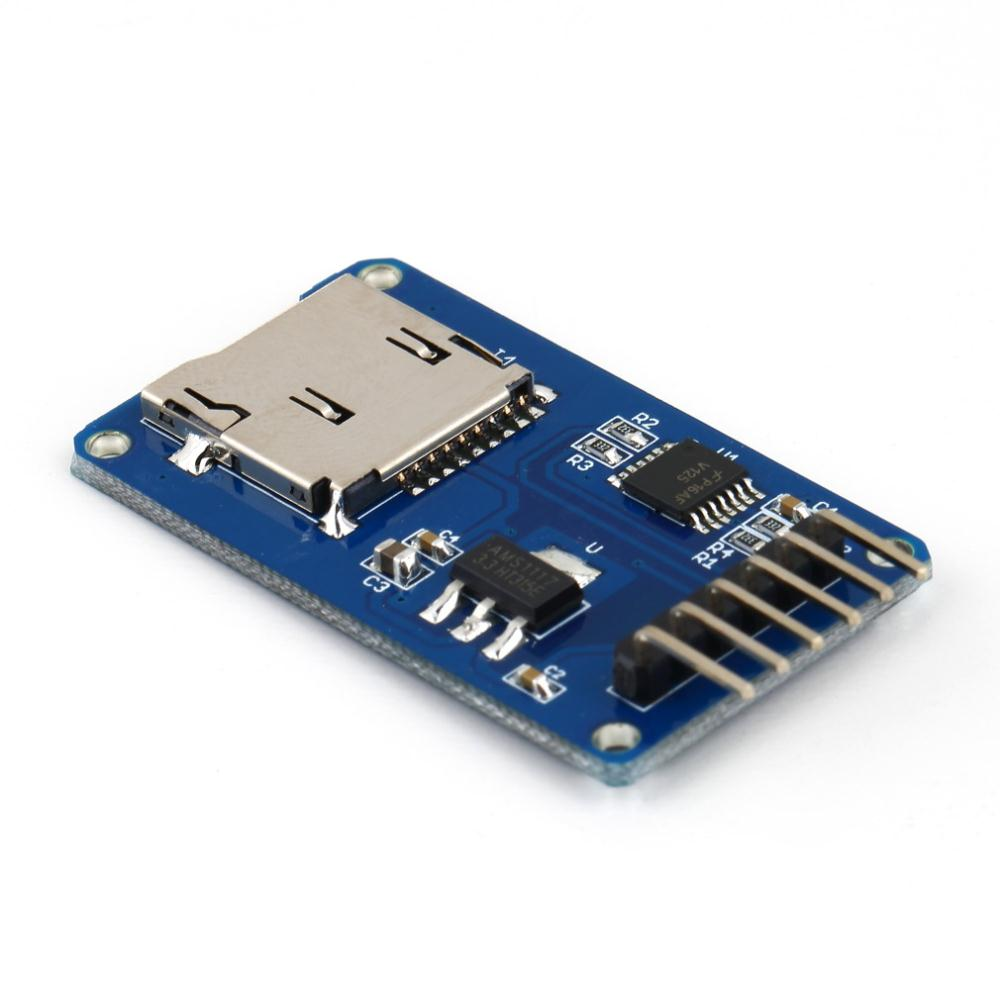
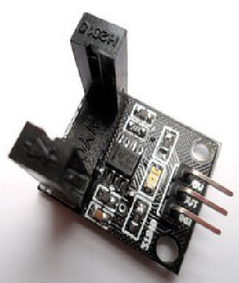

stc1000-datalogger
==================

The purpose of this project is to build a simple datalogger for the STC-1000 dual stage thermostat by making the required connections from the STC to an Arduino and let the Arduino store the data to an SD card. By maintaining the connections used by the STC programmer sketch (in the STC-1000\+ / STC-1000\+ PI projects) the Arduino can also (without any additional modification) function as a programmer by uploading any of those sketches.

STC-1000 Connections
--------------------

The relevant control lines from the STC needs to be extracted.

 
*Fig 1: Pinout of the LED PCB header.*

|Pin number|Description|
|--------|-------|
|1|Thermistor (1)|
|2|ICSPCLK / Thermistor (2)|
|3|ISCSPDAT / Buzzer|
|4|GND|
|5|GND|
|6|Vcc|
|7|Vcc|
|8|Vcc|
|9|Heating relay|
|10|Cooling relay|
|11|N/C|
|12|nMCLR|
|13|GND|
|14|GND|
|15|GND|
|16|GND|

Connections on the Arduino
--------------------------

TODO: Check this table for correctness...

|Arduino pin|Description|
|--------|-------|
|A0|Thermistor (1)|
|A1|ICSPCLK / Thermistor (2)|
|2|Photo interrupter module output|
|3|nMCLR|
|4|Heating relay|
|5|Cooling relay|
|6||
|7|Push button|
|8|ICSPCLK / Thermistor (2)|
|9|ISCSPDAT / Buzzer|
|10|SD Card Module CS (chip select)|
|11|SD Card Module MISO (master input, slave output)|
|12|SD Card Module MOSI (master output, slave input)|
|13|SD Card Module CLK (clock)|

 
*Fig 2: Micro SD card module.*

 
*Fig 3: Photo interrupter module.*
