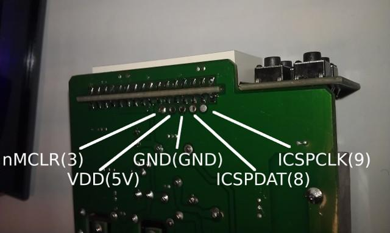
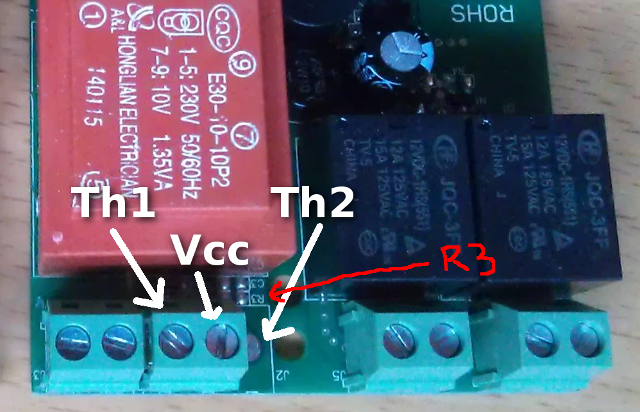
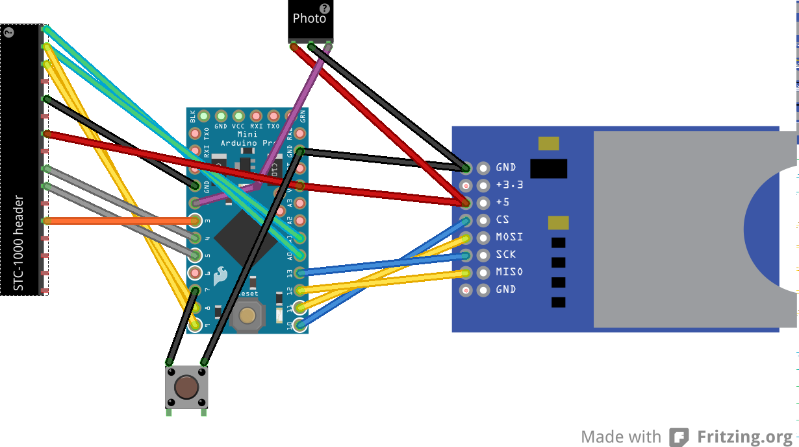
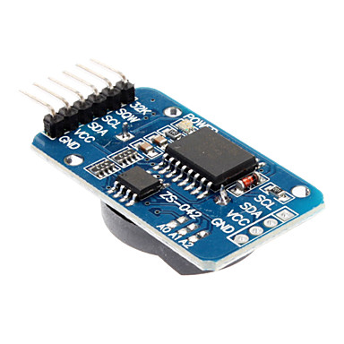

stc1000-datalogger
==================

The purpose of this project is to build a simple datalogger for the STC-1000 dual stage thermostat by making the required connections from the STC to an Arduino and let the Arduino store the data to an SD card. By maintaining the connections used by the STC programmer sketch (in the STC-1000\+ / STC-1000\+ PI projects) the Arduino can also (without any additional modification) function as a programmer by uploading any of those sketches.

STC-1000 Connections
--------------------

The relevant control lines from the STC needs to be extracted.

 
*Fig 1: Pinout of the LED PCB header.*

|Pin number|Description|
|--------|-------|
|1|Thermistor (1)|
|2|ICSPCLK / Thermistor (2)|
|3|ISCSPDAT / Buzzer|
|4|GND|
|5|GND|
|6|Vcc|
|7|Vcc|
|8|Vcc|
|9|Heating relay|
|10|Cooling relay|
|11|N/C|
|12|nMCLR|
|13|GND|
|14|GND|
|15|GND|
|16|GND|

 
*Fig 2: Programming header pinout.*

 
*Fig 3: Thermistor terminal pinout.*

Note that on the stock STC, the third pole (for Th2) as well as R3 (10k resistor, needed for Th2 input) is unpopulated. To connect a second probe, you will need this resistor (between ICSPCLK and ground) as well as an NTC 10k B2425 thermistor connected between Vcc and ICSPCLK. Luckily these connections can be found on the programming header as well.

Connections on the Arduino
--------------------------

|Arduino pin|Description|Device pin|
|-----------|-----------|----------|
|A0|Thermistor 1|STC|
|A1|ICSPCLK/Thermistor 2|STC|
|A4|SDA|RTC module|
|A5|SCL|RTC module|
|2|Counter input|Photo interrupter|
|3|nMCLR|STC|
|4|Heating relay|STC|
|5|Cooling relay|STC|
|6|||
|7|Push button|Push button|
|8|ISCSPDAT / Buzzer|STC|
|9|ICSPCLK / Thermistor (2)|STC|
|10|SD Card Module CS (chip select)|SD card module|
|11|SD Card Module MOSI (master output, slave input)|SD card module|
|12|SD Card Module MISO (master input, slave output)|SD card module|
|13|SD Card Module CLK (clock)|SD card module|

I tried to make a Fritzing sketch of the connections, but I think I need to work on my skills.
It might be of some help though.
 
*Fig 4: Fritzing sketch.*

 
*Fig 5: Micro SD card module.*

 
*Fig 6: Photo interrupter module.*

 
*Fig 7:Real time counter module.*

